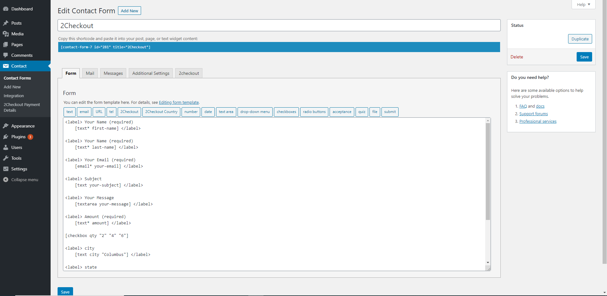
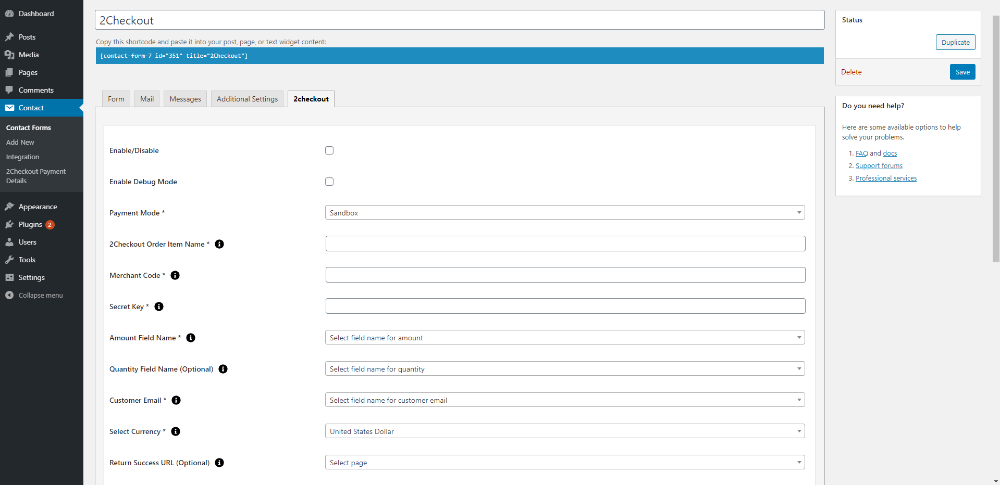
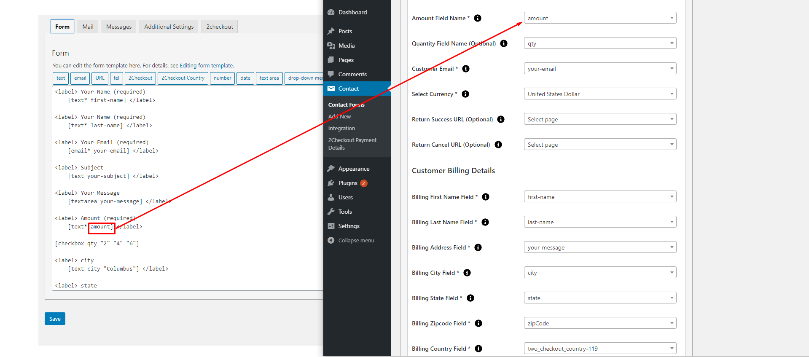
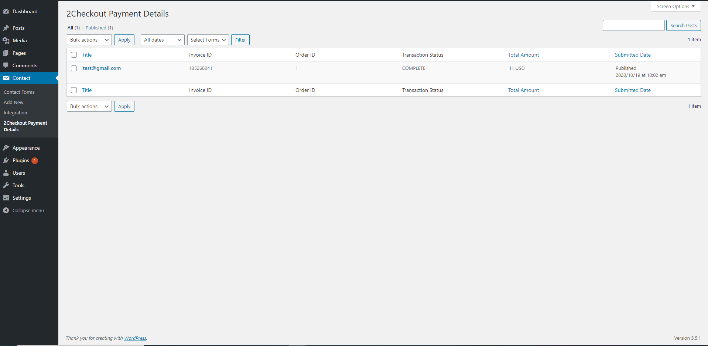
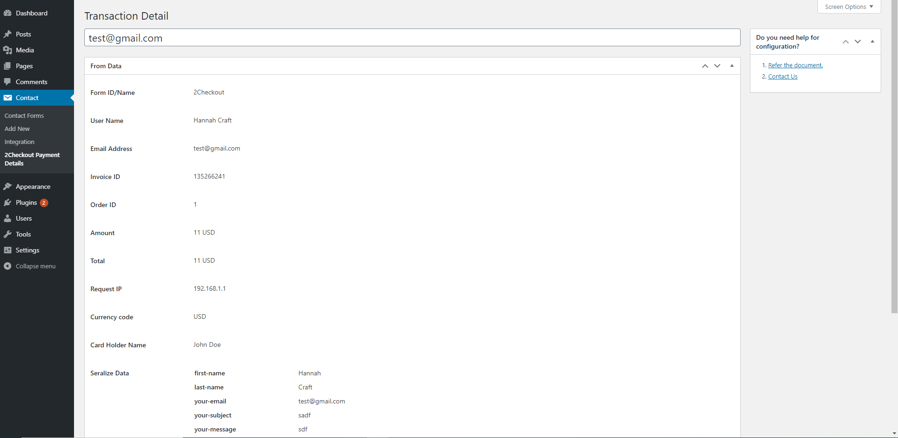
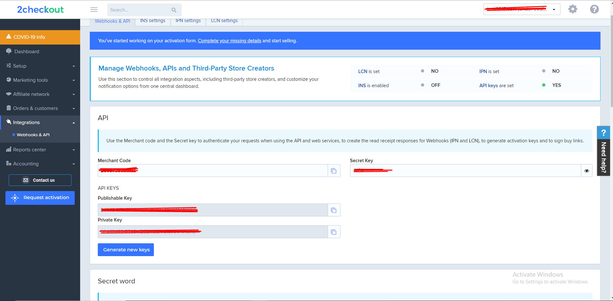

# Accept 2Checkout Payments Using Contact Form 7
The 2Checkout Payment system provides a secure, simple means of authorizing credit and debit card transactions from your website.The 2Checkout system provides a straightforward payment interface for the customer. It takes complete responsibility for the onsite transaction, including collection and encrypted storage of credit and debit card details, eliminating the security implications of holding such sensitive information on your servers.
This plugin helps you to accept payments on your Contact Form 7 using 2Checkout Accounts.

# Installation
1. Download the plugin zip file from WordPress.org plugin site to your desktop / PC
2. If the file is downloaded as a zip archive, extract the plugin folder to your desktop.
3. With your FTP program, upload the plugin folder to the wp-content/plugins folder in your WordPress directory online
4. Go to the Plugin screen and find the newly uploaded Plugin in the list.
5. Click ‘Activate Plugin’ to activate it.

# How To Use
You have to configure it from wp-admin > Contact > Add/Edit Contact Forms (Contact Form 7 needs to be activated before) to use this plugin.

You will find a new tab, “2checkout,” along with Form, Mail, Messages, Additional Settings, where you can make all settings related to the 2checkout plugin.

Note: You need to add the “2checkout & 2checkout Country” tag in your form. You will find a tag “2checkout” along with text, email, URL, etc.

To use the 2checkout option, first, you need to create and save form tags.

You can use the Country field tag option to display country in the drop-down if you are going with the custom approach, you need to set the drop-down value in ISO 3166 ( Examples: GB,IE, and DE ), so we prefer to use our tag to display country list.

2checkout Settings and Configuration

2checkout Amount Field Configuration

2checkout Payment Detail Page

2checkout Transaction Detail Page

To add the 2Checkout payment form to your Contact Form 7, find the setting attributes given below:

- **Enable 2checkout Payment Form**
 Check the 2checkout Payment Form option for 2checkout submit button activation.
 
 - **Enable Debug Mode**
 Check the Enable Debug Mode to start transaction debugging.
 
  - **Payment Mode**
 This option will allow you to set the Sandbox 2checkout payment process in test mode.
 
 - **Merchant Code (required)**
 This field is required when you want to take payment using 2checkout.
 Get Your Merchant Code:
 

- **Secret Key (required)**
 This field is required when you want to take payment using 2checkout.
Get Your Secret Key:

 - **Amount Field Name (required)**
 You have to select a name attribute for the amount field of Contact Form 7 like dropdown menu, textbox, hidden field, radio buttons, etc.
 
 - **Quantity Field Name (optional)**
 You have to select a name attribute for the quantity field of Contact Form 7 like dropdown menu, textbox, hidden field, radio buttons, etc.
 
 - **Customer Email (required)**
 You have to set a name attribute for the text field of contact form 7, from which you need to pass the custom email of the customer to the 2Checkout website.
 
 - **Select Currency (required)**
 You can select your currency of 2Checkout here. The default is set as USD(United States Dollar).
 
  - **Success Return URL (optional)**
 You can enter the URL of the page to redirect for a Successful 2Checkout Payment transaction.
 
 - **Cancel Return URL (optional)**
 You can enter the URL of the page to redirect if a transaction fails.

- **Customer Billing Details**
 **1. First Name (required)**
   You have to select a name attribute for the first name field of contact form 7.
 
 
# Getting Help
If you have any difficulties while using this Plugin, please feel free to contact us at opensource@zealousweb.com. We also offer custom WordPress extension development and WordPress theme design services to fulfill your e-commerce objectives. Our professional dy‐ namic WordPress experts provide profound and customer-oriented development of your project within short timeframes. Thank you for choosing a Plugin developed by ZealousWeb!
